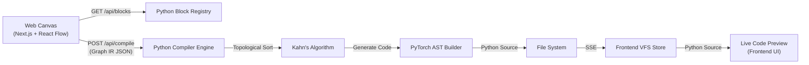

# ArchIDE — Architecture Overview

ArchIDE is a modern, web-native visual IDE for building machine learning model architectures by dragging, dropping, and connecting blocks, automatically generating clean PyTorch (`nn.Module`) code.

---

## 1. System Architecture & Data Flow

The application uses a separated frontend/backend architecture, optimized for both a responsive UI and powerful graph processing.

---

## 2. Frontend (Next.js, React Flow, Zustand)

**Core State Philosophy (VFS vs Editor)**
- `vfsStore.ts`: Manages filesystem state, open tabs, node/edge configurations for graphs, and variables.
- `editorStore.ts`: Manages UI state (active sidebars, drag-and-drop clipboard, shape errors).

**Critical Rule: Uncontrolled Canvas State**
In `src/components/DnDCanvas.tsx`, `ReactFlow` operates in **uncontrolled mode** (using `defaultNodes` and `defaultEdges` rather than controlled state hooks).
- Controlled state causes synchronization loops and drag latency with React Flow's internal spatial index.
- To modify nodes from outside the canvas (e.g. from `PropertiesPanel` or `VariablesPanel`), use `useReactFlow().setNodes()` to mutate node data immutably.
- A debounced `useEffect` in `DnDCanvas` pushes live changes back to the `vfsStore` and backend.

**Main Components**:
- **ActivityBar & Sidebars**: Manages VFS Explorer, Block Library, and Variables.
- **DnDCanvas**: Multi-tab uncontrolled canvas.
- **PropertiesPanel**: Modifies node parameters.
- **Header**: Orchestrates `/api/compile` and handles API payloads.

---

## 3. Backend (FastAPI, Python Compiler)

**Storage Layer (`storage.py`)**
A singleton `GraphStorage` handles all disk I/O, writing generated PyTorch code and JSON graphs to `workspace/python/` and `workspace/graphs/`.

**Block Registry (`registry.py` & `blocks/`)**
The Python backend acts as the authoritative source for what blocks exist. The registry defines layer parameters, default values, and whether a layer is stateful (`is_functional: False`) or purely mathematical (`is_functional: True`).

**PyTorch Compiler (`compiler.py`)**
Translates the JSON Graph IR into a functional PyTorch script:
1. **Topological Sorting (Kahn's Algorithm)**: Sorts nodes from inputs to outputs. Detects cycles and returns `400 Bad Request`. Handles sub-graph passes for custom modules.
2. **Static Shape Inference**: Passes actual tensor shapes through blocks before codegen, ensuring validity.
3. **Code Construction**:
   - `init_param` variables and stateful layers are injected into `__init__`.
   - `local_const` variables are emitted as module-level constants.
   - Functional math and standard layers are executed in the `forward` pass, routing variable names based on graph edges.
