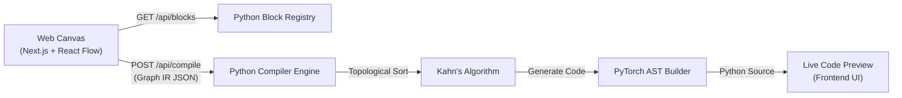

# ArchiDE — Architecture Overview

ArchiDE is a modern, web-native visual IDE for building machine learning model architectures by dragging, dropping, and connecting blocks, automatically generating clean PyTorch (`nn.Module`) code.

---

## 1. System Architecture

The application uses a separated frontend/backend architecture, optimized for both a responsive UI and powerful graph processing.

---

## 2. Frontend (Next.js & React Flow)
**Tech Stack**: Next.js (App Router), React Flow (`@xyflow/react`), Zustand, TailwindCSS.

### Core Canvas Integration
The frontend relies heavily on **React Flow**. Crucially, the canvas (`DnDCanvas`) operates in **uncontrolled mode** (using `defaultNodes` and `defaultEdges` rather than controlled state hooks like `useNodesState`). 

This architectural choice allows the React Flow internal store to be the single source of truth. When a user edits a property in the sidebar (`PropertiesPanel`), the frontend uses `useReactFlow().setNodes()` to update the internal store, ensuring the graph visualization and the data payloads are always perfectly synchronized.

### API Integration
- The frontend fetches the dynamic block library via `GET /api/blocks` and populates the draggable sidebar palette.
- When "Export PyTorch" is clicked, it packages the current nodes and edges into a JSON `CompileRequest` and sends it to `POST /api/compile`.

---

## 3. Backend (FastAPI & Python Engine)
**Tech Stack**: FastAPI, Pydantic, Python 3.

### Pydantic Data Models (`backend/models.py`)
All communication is strictly validated using Pydantic models. The core models are `Node`, `Edge`, `BlockDef`, and `CompileRequest`. 

### Block Registry (`backend/registry.py`)
Instead of hardcoding layer properties in the frontend, the Python backend acts as the authoritative source for what blocks exist. The registry defines layer parameters, default values, and whether a layer is stateful (`is_functional: False`) or purely mathematical (`is_functional: True`).

### PyTorch Compiler (`backend/compiler.py`)
The compiler takes the JSON Graph IR and translates it into a functional PyTorch script.
1. **Topological Sorting**: It uses Kahn's algorithm to sort the nodes from inputs to outputs. If a user accidentally draws a loop, Kahn's algorithm detects the cycle and throws a `ValueError`, returning a `400 Bad Request` to the frontend.
2. **Code Construction**:
   - Iterates over sorted nodes.
   - For stateful layers (e.g., `nn.Linear`, `nn.Conv2d`), it appends an initialization string to the `__init__` constructor and a standard execution string to `forward`.
   - For functional math (e.g., `Add`, `Split`), it only inserts logic into the `forward` pass, routing variable names accurately based on the React Flow edge handles.
