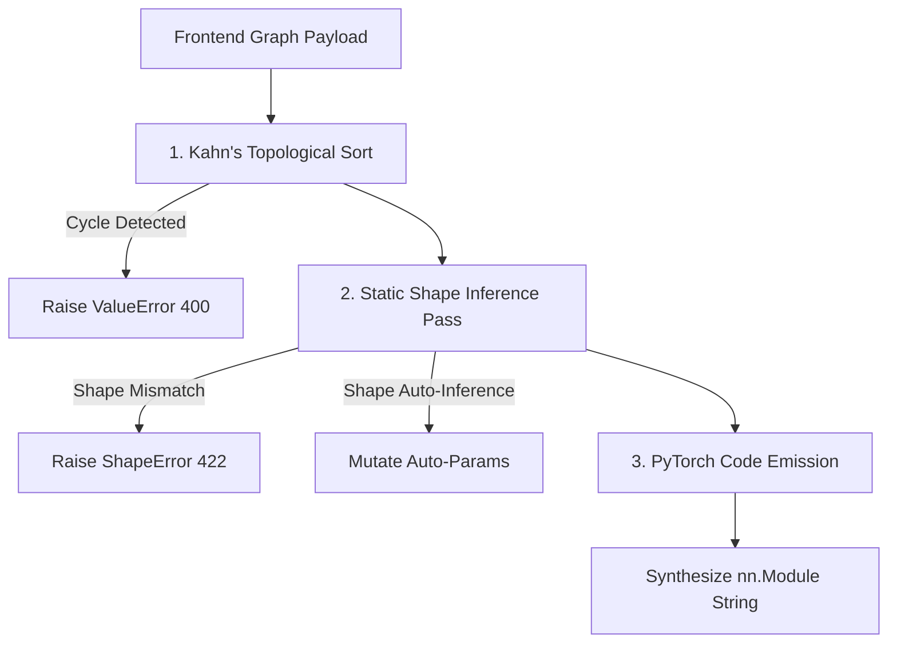

# ArchIDE: PyTorch Compiler Engine Design

This document details the architecture and execution pipeline of the ArchIDE PyTorch code compiler and shape inference engine.

> [!NOTE]
> **Source Files**:
> - Compiler Core: [`backend/compiler.py`](../../backend/compiler.py)
> - Pydantic Request Models: [`backend/models.py`](../../backend/models.py#L4-L28)
> - API Routing & Exception Handling: [`backend/main.py`](../../backend/main.py#L40-L90)

---

## 1. Request Schemas (`backend/models.py`)

The compiler receives graph representations from the frontend as `CompileRequest` or `CheckRequest` payloads:

```python
class GraphParamDef(BaseModel):
    name: str
    type: str = "int"
    default: Any = None
    description: Optional[str] = None

class Node(BaseModel):
    id: str
    position: Optional[Dict[str, float]] = None
    data: NodeData  # block_id, label, is_functional, paramValues, varName, custom_module_id

class Edge(BaseModel):
    id: str
    source: str
    sourceHandle: str
    target: str
    targetHandle: str

class GraphData(BaseModel):
    name: str = "Model"
    parameters: Optional[List[GraphParamDef]] = []
    nodes: List[Node]
    edges: List[Edge]

class CompileRequest(BaseModel):
    main_graph_id: str
    graphs: Dict[str, GraphData]
```

---

## 2. Compilation Pipeline



### Stage 1: Topological Sort (`backend/compiler.py:L47-L86`)
To ensure blocks are executed in valid mathematical dependency order, the compiler runs **Kahn's Algorithm** in two passes:
1. **Graph-Level Sort**: Resolves inter-module dependencies across `request.graphs`. Custom modules are detected via `custom_module_id` payloads. If Graph A uses a custom module defined in Graph B, Graph B is sorted first.
2. **Node-Level Sort**: Computes `in_degree` (incoming edges) for every node inside a graph. Initializes a queue with all zero `in_degree` nodes.
3. Pops nodes deterministically (`queue.sort()`), decrements neighbor degrees, and pushes newly unblocked nodes.
4. If `len(sorted_nodes) != len(nodes)`, a cyclic dependency exists and the compiler raises `ValueError` (mapped to HTTP `400 Bad Request`).

### Stage 2: Static Shape & Semantic Analysis (`backend/compiler.py:L78-L148`)
The `shape_inference_pass` traverses the topologically sorted nodes to validate tensor compatibility without running PyTorch:
1. **Upstream Gathering**: Maps each input port to its incoming source shape tuple (or `("ANY",)` if dynamic).
2. **Block Inference**: Calls `block.infer_shapes(incoming, params)` for each node.
3. **Auto-Parameter Inference**: When a block parameter is `-1` (e.g. `in_features=-1`, `in_channels=-1`, `num_features=-1`), the block auto-infers the dimension from incoming tensor shapes and mutates `node.data.paramValues`.
4. **Mismatch Detection**: If dimensions violate layer constraints or broadcasting rules, `ShapeError` is raised with `node_id`, `node_label`, and `edge_ids` (mapped to HTTP `422 Unprocessable Content`).

### Stage 3: PyTorch AST Code Generation (`backend/compiler.py:L154-L333`)
The code generator synthesizes a clean, standard PyTorch `nn.Module`:

1. **Constructor & Parameter Signatures**:
   - For submodules with declared `GraphData.parameters`, synthesizes parameterized signatures: `def __init__(self, in_channels=64, out_channels=128, ...):`.
   - Parent graphs instantiate submodules with forwarded parameters: `self.res_block = ResBlock(in_channels=64, out_channels=128)`.
2. **Input Signature Resolution** ([`backend/compiler.py`](../../backend/compiler.py#L154-L192)):
   - Identifies `input` nodes and creates disambiguated argument names: `def forward(self, x_input, x_input_2, ...):`.
3. **Variable Naming Priority** ([`backend/compiler.py`](../../backend/compiler.py#L194-L220)):
   - User override in `paramValues["_output_aliases"][port.id]`
   - User-defined `varName` on the node
   - Port default `var_hint` (e.g. `fc_out`, `conv_feat`, `sum`)
   - Sequential fallback: `x_{node_id}`
4. **`__init__()` Emission**:
   - Iterates non-functional nodes and calls `block.emit_init(node.id, params)` to create layers (e.g. `self.layer_n2 = nn.Linear(128, 64, bias=True)`).
5. **`forward()` Emission**:
   - Calls `block.emit_forward(node.id, input_vars, output_vars, params)` to produce assignment lines.
   - Collects outputs from `output` blocks to construct the final `return <vars>` statement.

---

## 3. Headless Testing & Batch Compilation (`backend/project_loader.py`)

ArchiDE includes a headless project loader (`backend/project_loader.py`) allowing CLI, CI, or test suites to load, validate, and compile complex multi-graph architectures directly:

```python
from backend.project_loader import load_project, compile_project

# Load project directory containing archide.project.json & blocks/
project_data = load_project("path/to/project_dir")
code = compile_project(project_data)
```

---

## 4. Compiler API Endpoints (`backend/main.py`)

| Endpoint | Method | Request Payload | Response Schema | Purpose |
|---|---|---|---|---|
| `/api/check` | `POST` | `CheckRequest` | `{"ok": True, "node_shapes": {...}, "node_params": {...}}` | Fast static shape validation & canvas badge updates without code generation |
| `/api/compile` | `POST` | `CompileRequest` | `{"code": "import torch\n..."}` | Full static check followed by complete PyTorch module code synthesis |
