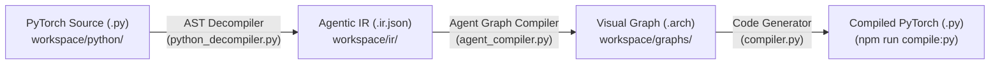

# Model Decompilation & Agentic IR Architecture

This document provides a comprehensive technical guide for developers on how the **PyTorch AST Decompiler** and **Agentic Intermediate Representation (IR)** pipeline work within ArchiDE.

---

## 1. High-Level Architecture

ArchiDE provides a bidirectional bridge between pure PyTorch source code (`.py`), human/AI-readable Intermediate Representation (`.ir.json`), and visual React Flow graphs (`.arch`).



### The Two Core Invariants:
1. **Source Immutability**: Running `npm run decompile:py` and `npm run compile:arch` will **never** alter or overwrite your source `.py` files.
2. **Deterministic Roundtrip**: Valid PyTorch architectures convert into clean, minimal `.ir.json` structures and expand into fully laid-out, shape-validated `.arch` canvas files.

---

## 2. Agentic IR (`.ir.json`) Specification

The Agentic IR is a declarative, human-readable JSON schema designed for both AI agents and developers to specify neural network architectures concisely without worrying about visual node IDs or canvas coordinates.

### IR JSON Schema

```json
{
  "name": "model_name",
  "variables": [
    {
      "id": "var_embed_dim",
      "name": "embed_dim",
      "type": "int",
      "default": 256,
      "description": "Hidden dimension size",
      "scope": "init_param"
    }
  ],
  "nodes": {
    "node_alias": {
      "block": "linear | conv2d | layernorm | custom_module | ...",
      "params": {
        "in_features": "@var:embed_dim",
        "out_features": 512,
        "bias": true
      },
      "custom_module_id": "modules/submodule_name"
    }
  },
  "edges": [
    "src_alias -> dst_alias",
    "src_alias:out_handle -> dst_alias:in_handle",
    ["src_alias", "dst_alias"]
  ]
}
```

### Key Elements:

- **`variables`**: Model constructor arguments (`init_param`) and hyperparameters with types (`int`, `float`, `bool`, `string`, `shape`) and default values.
- **`nodes`**: A map from unique local aliases (e.g. `stem`, `stage1`, `mlp`) to block definitions.
  - `@var:<name>` bindings dynamically link constructor variables to block parameters.
  - `custom_module_id` links composite submodules (e.g. `modules/cnn`, `modules/transformer`).
- **`edges`**: Directed dataflow connections. Supports shorthand string syntax (`"node_a -> node_b"`), handle-specific syntax (`"attention:out -> fusion:in_a"`), and array pairs (`["node_a", "node_b"]`).

---

## 3. How the Decompiler Works (`backend/python_decompiler.py`)

The AST decompiler converts arbitrary PyTorch `nn.Module` classes into Agentic IR without executing the Python file.

### Step 1: AST Parsing & Import Tracking
- Analyzes `ast.ImportFrom` and `ast.Import` statements to track submodule class mappings (e.g., `from modules.cnn import CNN` maps `CNN -> modules/cnn`).

### Step 2: Extracting Constructor Variables (`_parse_init`)
- Inspects `def __init__(self, ...)` parameters, type annotations, and default values.
- Maps `self.var_name = var_name` attribute assignments to `init_param` variables in the IR.

### Step 3: Layer Instance Registry (`_parse_init`)
- Walks `self.<layer_name> = nn.<Layer>(...)` assignments.
- Recognizes native PyTorch layers (`nn.Linear`, `nn.Conv2d`, `nn.LayerNorm`, `nn.MultiheadAttention`, `nn.GELU`, `nn.Dropout`, etc.).
- Recognizes `nn.Sequential` and `nn.ModuleList` containers, recursively extracting nested layers.
- Recognizes custom submodules and maps keyword/positional arguments.

### Step 4: Dataflow Graph Reconstruction (`_parse_forward`)
- Walks the AST of `def forward(self, ...)`:
  - Tracks variable assignments and symbol mutations (e.g. `x = self.stem(x)`, `residual = x`).
  - Converts tensor binary operators (`+`, `-`, `*`, `@`) into `add`, `sub`, `mul`, `matmul` blocks.
  - Resolves functional calls (`torch.cat`, `torch.relu`, `F.gelu`, `torch.softmax`) into functional nodes.
  - Resolves tensor transformations (`x.flatten(2)`, `x.transpose(1, 2)`, `x.squeeze(-1)`, `x.unsqueeze(-1)`) into shape/reshape blocks.
  - Reconstructs multi-input and multi-output connections with exact handle signatures (e.g. `q`, `k`, `v`, `in_1`, `in_2`).

---

## 4. How the Agent Graph Compiler Works (`backend/agent_compiler.py`)

The compiler converts `.ir.json` files into fully functional `.arch` visual React Flow graphs.

1. **Node Synthesis**: Converts each IR node alias into a React Flow node with a unique UUID, block definition schema, input/output port definitions, and parameter values.
2. **Automatic Layered Layout (`_assign_layers`)**: Uses topological in-degree sorting to calculate clean X/Y canvas coordinates (`x = 100 + layer * 300`, `y = 250`).
3. **Submodule Port Synthesis (`_load_custom_module_ports`)**: Inspects linked submodule `.arch` files to dynamically discover port names and signatures.
4. **Validation Pipeline (`compiler.validate`)**:
   - Performs Kahn's topological sort across the multi-graph hierarchy.
   - Runs static Shape Inference to ensure tensor dimension compatibility.
   - Compiles AST PyTorch code in-memory and verifies syntax with `compile(code, "<model>", "exec")`.

---

## 5. Developer CLI & NPM Scripts

| Command | Shortcut | Description |
|---|---|---|
| `npm run decompile:py` | `bash scripts/decompile_python_to_ir.sh` | Decompiles all `workspace/python/**/*.py` files to `workspace/ir/*.ir.json`. |
| `npm run compile:arch` | `bash scripts/compile_all_to_arch.sh` | Compiles & validates all `workspace/ir/*.ir.json` files to `workspace/graphs/*.arch`. |
| `npm run decompile:ir` | `bash scripts/decompile_all_to_ir.sh` | Exports visual `workspace/graphs/*.arch` graphs back to `workspace/ir/*.ir.json`. |
| `npm run compile:py` | `bash scripts/compile_all_to_python.sh` | Compiles visual `.arch` graphs to clean PyTorch code in `workspace/python/`. |

### Full Pipeline:
```bash
npm run decompile:py && npm run compile:arch
```
