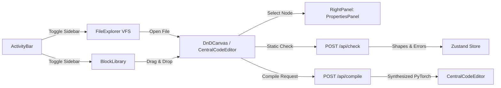

# ArchIDE: Frontend Architecture & Component Specification

This document provides the formal architecture and technical guidelines for the ArchIDE visual DAG builder frontend.

> [!NOTE]
> **Source Files** (modular structure as of Aug 26, 2026):
> - Layout Shell: [`src/app/page.tsx`](../../src/app/page.tsx)
> - Activity Bar: [`src/components/ActivityBar.tsx`](../../src/components/ActivityBar.tsx)
> - File & Folder Explorer (VFS): [`src/components/FileExplorer.tsx`](../../src/components/FileExplorer.tsx)
> - Canvas + Dual-View Switcher: [`src/components/DnDCanvas.tsx`](../../src/components/DnDCanvas.tsx)
> - Central Python Code Editor: [`src/components/CentralCodeEditor.tsx`](../../src/components/CentralCodeEditor.tsx)
> - Custom Node: [`src/components/CustomNode.tsx`](../../src/components/CustomNode.tsx)
> - Tensor Edge: [`src/components/TensorEdge.tsx`](../../src/components/TensorEdge.tsx)
> - Properties Inspector: [`src/components/PropertiesPanel.tsx`](../../src/components/PropertiesPanel.tsx)
> - Block Library Sidebar: [`src/components/BlockLibrary.tsx`](../../src/components/BlockLibrary.tsx)
> - Header + API Logic: [`src/components/Header.tsx`](../../src/components/Header.tsx)
> - Right Panel Shell: [`src/components/RightPanel.tsx`](../../src/components/RightPanel.tsx)
> - Doc Popups: [`src/components/DocPanels.tsx`](../../src/components/DocPanels.tsx)
> - Shared Constants: [`src/lib/constants.ts`](../../src/lib/constants.ts)
> - Global Editor Store: [`src/lib/store.ts`](../../src/lib/store.ts)

---

## 1. Technical Stack & State Model

ArchIDE's frontend is built with **Next.js (App Router)**, **React Flow (`@xyflow/react`)**, **Zustand**, and **TailwindCSS**.

### ⚠️ Critical Guardrail: Uncontrolled Canvas State
- **Uncontrolled React Flow is Required**: In [`src/components/DnDCanvas.tsx`](../../src/components/DnDCanvas.tsx), `ReactFlow` must strictly use `defaultNodes` and `defaultEdges` rather than controlled `nodes={nodes}` / `edges={edges}` props.
- **Why?**: Controlled state causes synchronization loops and drag latency with React Flow's internal spatial index.
- **State Manipulation**: To modify nodes from outside the canvas (e.g. from `PropertiesPanel`), use `const { setNodes } = useReactFlow()` and mutate node data immutably.
- **Reading Selected Nodes**: Selected state is read directly from the internal store via `useNodes().find(n => n.selected)` rather than tracking local selection state.

---

## 2. Component Architecture

### 1. `ActivityBar` & `FileExplorer` ([`src/components/ActivityBar.tsx`](../../src/components/ActivityBar.tsx), [`src/components/FileExplorer.tsx`](../../src/components/FileExplorer.tsx))
- **ActivityBar**: Far-left 44px icon bar allowing instant switching between **Explorer** (VFS tree), **Block Library** (Layer palette), and future views.
- **FileExplorer (VFS)**: OneCompiler-style directory tree managing nested folders, visual graph files (`.json`), and Python code scripts (`.py`).
- **Project Actions**: Supports in-place file/folder creation, renaming, deletion, **Export Project** (`archide.project.json` download), and **Import Project** (browser JSON upload).

### 2. `DnDCanvas` + `FileTabBar` + `CentralCodeEditor` ([`src/components/DnDCanvas.tsx`](../../src/components/DnDCanvas.tsx), [`src/components/CentralCodeEditor.tsx`](../../src/components/CentralCodeEditor.tsx))
- **FileTabBar**: Multi-tab strip displaying open files, relative paths (e.g. `blocks/conv/res_block.json`), non-destructive close actions, and a dual-view mode switcher (`[ ☩ Graph | <> Python Code ]`).
- **CentralCodeEditor**: Full-workspace code viewer and editor with line numbering gutter, syntax color styling, quick copy, and `.py` file download.
- **Visual Canvas**: Renders the interactive grid canvas with `MiniMap`, `Controls`, and dot grid `Background`.

### 3. `CustomNode` & `TensorEdge` ([`src/components/CustomNode.tsx`](../../src/components/CustomNode.tsx), [`src/components/TensorEdge.tsx`](../../src/components/TensorEdge.tsx))
- **Dynamic Handles & Accents**: Color-coded category accents, input/output connection handles, and hover shape tooltips.
- **Shape Flow**: Tensor edges render smooth bezier curves with midpoint chips displaying propagating tensor dimensions.

### 4. `RightPanel` & `PropertiesPanel` ([`src/components/RightPanel.tsx`](../../src/components/RightPanel.tsx), [`src/components/PropertiesPanel.tsx`](../../src/components/PropertiesPanel.tsx))
- **Dedicated Inspector**: Single-purpose right panel dedicated to node configuration, custom output variable names, dynamic hyperparameters, shape analysis, and layer documentation.

---

## 3. Global State: Zustand Store (`src/lib/store.ts`)

| State Field | Type | Description |
|---|---|---|
| `folders` | `Folder[]` | List of virtual directory folders (`id`, `name`, `parentId`, `isExpanded`) |
| `files` | `GraphFile[]` | List of project files with `nodes`, `edges`, `parameters`, `fileType`, and coordinates |
| `openTabIds` | `string[]` | IDs of currently open tabs in the editor strip |
| `activeFileId` | `string` | ID of the currently active file |
| `entryFileId` | `string` | ID of the designated root entry point file (undeletable main graph) |
| `activeViewMode` | `'graph' \| 'code'` | Main workspace mode (visual canvas vs Python code editor) |
| `generatedCode` | `string` | Compiled PyTorch code for the active module / model |
| `shapeErrorNodeId` | `string \| null` | Node ID with an active shape mismatch (highlights node red) |
| `nodeShapes` | `Record<string, Record<string, number[]>>` | Maps `node_id -> { port_id: shape_array }` returned by `/api/check` |

---

## 4. Backend Communication Pipeline

1. **Static Shape Check ("Check Shapes")**:
   - Sends recursive multi-graph payload `{ main_graph_id, graphs }` with declared parameters to `POST /api/check`.
   - On success (`200 OK`): Updates `nodeShapes` in store; shape chips appear on edges and nodes.
   - On error (`422 Unprocessable Content`): Highlights error node and reports shape mismatch details.
2. **PyTorch Export ("Export PyTorch")**:
   - Sends `{ main_graph_id, graphs }` to `POST /api/compile`.
   - On success: Stores compiled code, clears shape errors, and automatically switches `activeViewMode` to `'code'`.

