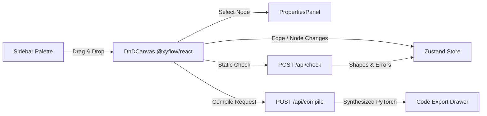

# ArchIDE: Frontend Architecture & Component Specification

This document provides the formal architecture and technical guidelines for the ArchIDE visual DAG builder frontend.

> [!NOTE]
> **Source Files**:
> - Main Canvas & Shell: [`src/app/page.tsx`](../../src/app/page.tsx)
> - Custom Node Component: [`src/components/CustomNode.tsx`](../../src/components/CustomNode.tsx)
> - Tensor Edge Component: [`src/components/TensorEdge.tsx`](../../src/components/TensorEdge.tsx)
> - Global Editor Store: [`src/lib/store.ts`](../../src/lib/store.ts)

---

## 1. Technical Stack & State Model

ArchIDE's frontend is built with **Next.js (App Router)**, **React Flow (`@xyflow/react`)**, **Zustand**, and **TailwindCSS**.

### ⚠️ Critical Guardrail: Uncontrolled Canvas State
- **Uncontrolled React Flow is Required**: In [`src/app/page.tsx`](../../src/app/page.tsx), `ReactFlow` must strictly use `defaultNodes` and `defaultEdges` rather than controlled `nodes={nodes}` / `edges={edges}` props.
- **Why?**: Controlled state causes synchronization loops and drag latency with React Flow's internal spatial index.
- **State Manipulation**: To modify nodes from outside the canvas (e.g. from `PropertiesPanel`), use `const { setNodes } = useReactFlow()` and mutate node data immutably.
- **Reading Selected Nodes**: Selected state is read directly from the internal store via `useNodes().find(n => n.selected)` rather than tracking local selection state.

---

## 2. Core Components

### 1. `DnDCanvas` ([`src/app/page.tsx`](../../src/app/page.tsx#L350-L465))
- Renders the interactive grid canvas with `MiniMap`, `Controls`, and dot grid `Background`.
- Handles `onDrop`: Deserializes block definition JSON from `dataTransfer`, sets initial parameter defaults, computes canvas coordinates via `screenToFlowPosition`, and appends a `custom` node.
- Handles `onConnect`: Adds custom `tensor` edges between handles.
- Automatically clears `shapeErrorNodeId` when nodes or edges change.

### 2. `CustomNode` ([`src/components/CustomNode.tsx`](../../src/components/CustomNode.tsx))
- **Category Accent Strip**: Color-coded vertical indicator based on layer type.
- **Dynamic Handles**: Renders `Position.Left` target handles for `inputs` and `Position.Right` source handles for `outputs`. Hovering over handles displays the handle name and propagated tensor shape.
- **Error Badging**: If `shapeErrorNodeId === id`, highlights node with red border and renders an `AlertTriangle` "Shape mismatch" chip.
- **Variable Identifier Display**: Shows `→ {effectiveVar}` (e.g., custom name or auto-generated PyTorch variable name).
- **Hover Toolbar**: Quick duplicate and delete actions.
- **Shape Tooltip**: On hover, displays an elevated card listing input and output tensor dimensions (e.g. `[1×16×112×112]`).

### 3. `TensorEdge` ([`src/components/TensorEdge.tsx`](../../src/components/TensorEdge.tsx))
- Renders a smooth bezier curve with an invisible 16px hover hit area.
- Displays an `EdgeLabelRenderer` midpoint chip showing the active tensor shape flowing through the edge (retrieved from `useEditorStore((s) => s.nodeShapes)`).

### 4. `PropertiesPanel` ([`src/app/page.tsx`](../../src/app/page.tsx#L192-L346))
- **Node Identifier & VarName**: Allows editing node label and custom output variable name.
- **Three-Section Property Inspector**:
  1. *Tensor Shapes*: Displays read-only inferred port dimensions.
  2. *Hyperparameters*: Editable inputs (`int`, `float`, `string`, `bool`) for primary layer properties.
  3. *Advanced Properties*: Collapsible section for secondary settings (e.g. dilation, momentum, eps).
- **Dynamic Port Resizing**: When modifying `num_inputs` (on `AddBlock`) or `chunks` (on `SplitBlock`), dynamically updates node `inputs`/`outputs` arrays so the canvas immediately adds/removes connection handles.

### 5. `DocContextMenu` & `DocDetailsPanel` ([`src/app/page.tsx`](../../src/app/page.tsx#L469-L554))
- Right-clicking any block in the sidebar fetches documentation from `GET /api/blocks/{id}/docs` and presents a popup summary or full slide-out documentation panel.

---

## 3. Global State: Zustand Store (`src/lib/store.ts`)

| State Field | Type | Description |
|---|---|---|
| `generatedCode` | `string` | Current PyTorch module code string |
| `shapeErrorNodeId` | `string \| null` | Node ID with an active shape mismatch (highlights node red) |
| `nodeShapes` | `Record<string, Record<string, number[]>>` | Maps `node_id -> { port_id: shape_array }` returned by `/api/check` |
| `docMenuInfo` | `object \| null` | Coordinates and content for the right-click block documentation tooltip |
| `docPanelInfo` | `object \| null` | State for the slide-out full block documentation drawer |

---

## 4. Backend Communication Pipeline

1. **Palette Loading**: `GET /api/blocks` initializes the sidebar palette. If backend is offline, falls back to `FALLBACK_BLOCKS`.
2. **Static Shape Check ("Run Static Tensor Check")**:
   - Sends `{ nodes, edges }` to `POST /api/check`.
   - On success (`200 OK`): Updates `nodeShapes` in store; shape chips appear on edges and nodes.
   - On error (`422 Unprocessable Content`): Reads `detail.node_id`, sets `shapeErrorNodeId`, and displays toast with error details.
3. **PyTorch Export ("Export PyTorch")**:
   - Sends `{ nodes, edges }` to `POST /api/compile`.
   - On success: Stores compiled code in `generatedCode` and opens code viewer modal.
