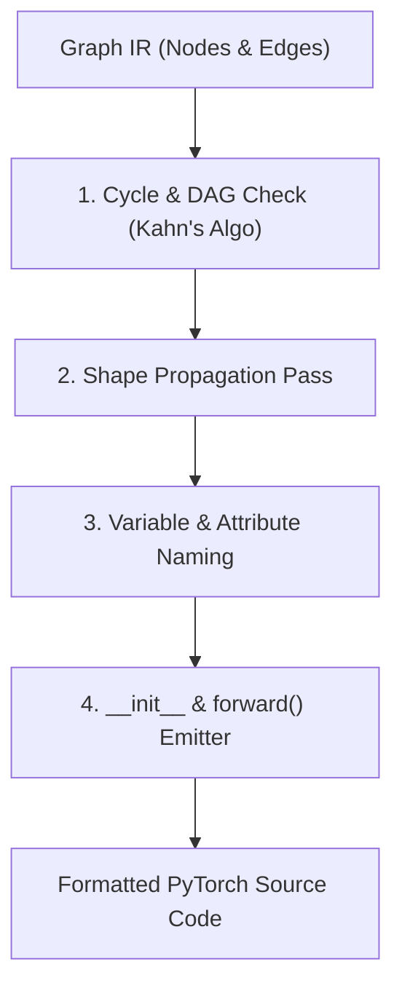

# ArchiDE — Graph IR & Code Generation Specification (Legacy)

> [!NOTE]
> **Status: 🏛️ Legacy / Design Reference**
> This document specifies the original client-side TypeScript Graph IR schema. In the active architecture, graph processing and code compilation are executed by the FastAPI backend (see [`../backend/compiler_design.md`](../backend/compiler_design.md)), while UI canvas mechanics are documented in [`architecture.md`](architecture.md).

---

## 1. Graph IR JSON Schema

The Graph IR is the canonical, portable JSON format that bridges the React Flow visual canvas and the PyTorch Code Generation Engine.

```json
{
  "$schema": "http://json-schema.org/draft-07/schema#",
  "title": "ArchiDE_Graph_IR",
  "type": "object",
  "properties": {
    "version": { "type": "string", "example": "1.0" },
    "metadata": {
      "type": "object",
      "properties": {
        "name": { "type": "string", "default": "MyModel" },
        "description": { "type": "string" },
        "created_at": { "type": "string" }
      },
      "required": ["name"]
    },
    "nodes": {
      "type": "object",
      "additionalProperties": {
        "type": "object",
        "properties": {
          "id": { "type": "string" },
          "block_type": { "type": "string" },
          "label": { "type": "string" },
          "position": {
            "type": "object",
            "properties": { "x": { "type": "number" }, "y": { "type": "number" } }
          },
          "params": { "type": "object" },
          "infer_shape": { "type": "array" }
        },
        "required": ["id", "block_type", "params"]
      }
    },
    "edges": {
      "type": "array",
      "items": {
        "type": "object",
        "properties": {
          "id": { "type": "string" },
          "source": { "type": "string" },
          "source_port": { "type": "string" },
          "target": { "type": "string" },
          "target_port": { "type": "string" }
        },
        "required": ["id", "source", "source_port", "target", "target_port"]
      }
    }
  },
  "required": ["version", "metadata", "nodes", "edges"]
}
```

---

## 2. Validation & Topological Sorting Algorithm

To convert an arbitrary visual graph into valid PyTorch code, ArchiDE executes a 3-pass compilation pipeline:



### Pass 1: Structural Validation & Topological Ordering

1. **In-Degree Calculation**: Calculate the in-degree of every node $N$ in the graph based on incoming edges to $N$.
2. **Kahn's Algorithm Queue**: Initialize a queue $Q$ with all nodes having `in_degree == 0` (e.g., `Input` node).
3. **Traversal**:
   - While $Q$ is not empty:
     - Pop node $u$. Append $u$ to `topological_order`.
     - For each outgoing edge $(u, v)$:
       - Decrement `in_degree[v]`.
       - If `in_degree[v] == 0`, push $v$ to $Q$.
4. **Cycle Error Detection**: If `topological_order.length != total_nodes`, throw a `GraphCycleError("Visual graph contains a cycle.")`.

---

## 3. Code Generation Engine Pipeline

Given a topologically sorted array of graph nodes and edge connections:

### Step 3.1: Attribute & Variable Mapping

- **Module Attributes** (`__init__`):
  Each module node gets a unique, clean attribute name:
  $$\text{attr\_name} = \text{sanitize\_snake\_case}(block\_type) + "\_" + index$$
  *Example*: `Conv2D` node #2 becomes `self.conv2d_2`.

- **Tensor Variables** (`forward()`):
  Each node's output port gets a variable name:
  $$\text{var\_name} = \text{attr\_name} + "\_out"$$
  *Example*: `conv2d_2_out`.

### Step 3.2: Class & `__init__` Generation

Iterate through nodes in topological order:

```python
class Model(nn.Module):
    def __init__(self):
        super().__init__()
        self.conv2d_1 = nn.Conv2d(3, 16, kernel_size=3, stride=1, padding=1)
        self.relu_1 = nn.ReLU()
        self.maxpool2d_1 = nn.MaxPool2d(kernel_size=2, stride=2)
        self.flatten_1 = nn.Flatten(start_dim=1, end_dim=-1)
        self.linear_1 = nn.Linear(16 * 112 * 112, 10)
```

### Step 3.3: `forward()` Pass Assembly

Track variable assignments per port:
- For input nodes: `x` is the input parameter.
- For single-input nodes: `var_out = self.layer(prev_var)`
- For multi-input nodes (`Add`, `Concat`):
  - `Add`: `res_out = var1 + var2`
  - `Concat`: `concat_out = torch.cat([var1, var2], dim=1)`
  - `MultiHeadAttention`: `attn_out, _ = self.mha(q_var, k_var, v_var)`

```python
    def forward(self, x):
        # Input shape: (1, 3, 224, 224)
        conv2d_1_out = self.conv2d_1(x)
        relu_1_out = self.relu_1(conv2d_1_out)
        maxpool2d_1_out = self.maxpool2d_1(relu_1_out)
        flatten_1_out = self.flatten_1(maxpool2d_1_out)
        linear_1_out = self.linear_1(flatten_1_out)
        return linear_1_out
```

---

## 4. Comprehensive Graph IR Example

Below is a complete Graph IR representing a **CNN classifier with a residual skip connection**:

```json
{
  "version": "1.0",
  "metadata": {
    "name": "ResNetBlockClassifier",
    "description": "CNN with residual addition and linear output head"
  },
  "nodes": {
    "node_1": {
      "id": "node_1",
      "block_type": "Input",
      "params": { "shape": "(1, 64, 56, 56)" },
      "position": { "x": 50, "y": 150 }
    },
    "node_2": {
      "id": "node_2",
      "block_type": "Conv2D",
      "params": { "in_channels": 64, "out_channels": 64, "kernel_size": 3, "stride": 1, "padding": 1 },
      "position": { "x": 250, "y": 100 }
    },
    "node_3": {
      "id": "node_3",
      "block_type": "ReLU",
      "params": {},
      "position": { "x": 450, "y": 100 }
    },
    "node_4": {
      "id": "node_4",
      "block_type": "Conv2D",
      "params": { "in_channels": 64, "out_channels": 64, "kernel_size": 3, "stride": 1, "padding": 1 },
      "position": { "x": 650, "y": 100 }
    },
    "node_5": {
      "id": "node_5",
      "block_type": "Add",
      "params": {},
      "position": { "x": 850, "y": 150 }
    },
    "node_6": {
      "id": "node_6",
      "block_type": "Output",
      "params": {},
      "position": { "x": 1050, "y": 150 }
    }
  },
  "edges": [
    { "id": "e1", "source": "node_1", "source_port": "out", "target": "node_2", "target_port": "x" },
    { "id": "e2", "source": "node_2", "source_port": "out", "target": "node_3", "target_port": "x" },
    { "id": "e3", "source": "node_3", "source_port": "out", "target": "node_4", "target_port": "x" },
    { "id": "e4", "source": "node_4", "source_port": "out", "target": "node_5", "target_port": "a" },
    { "id": "e5", "source": "node_1", "source_port": "out", "target": "node_5", "target_port": "b" },
    { "id": "e6", "source": "node_5", "source_port": "out", "target": "node_6", "target_port": "in" }
  ]
}
```
