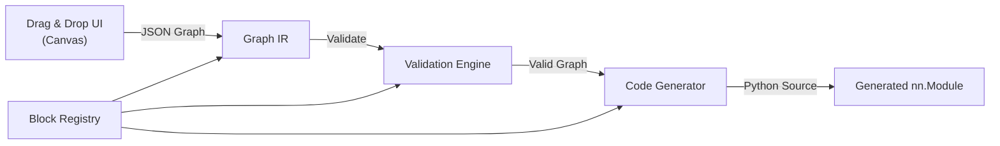
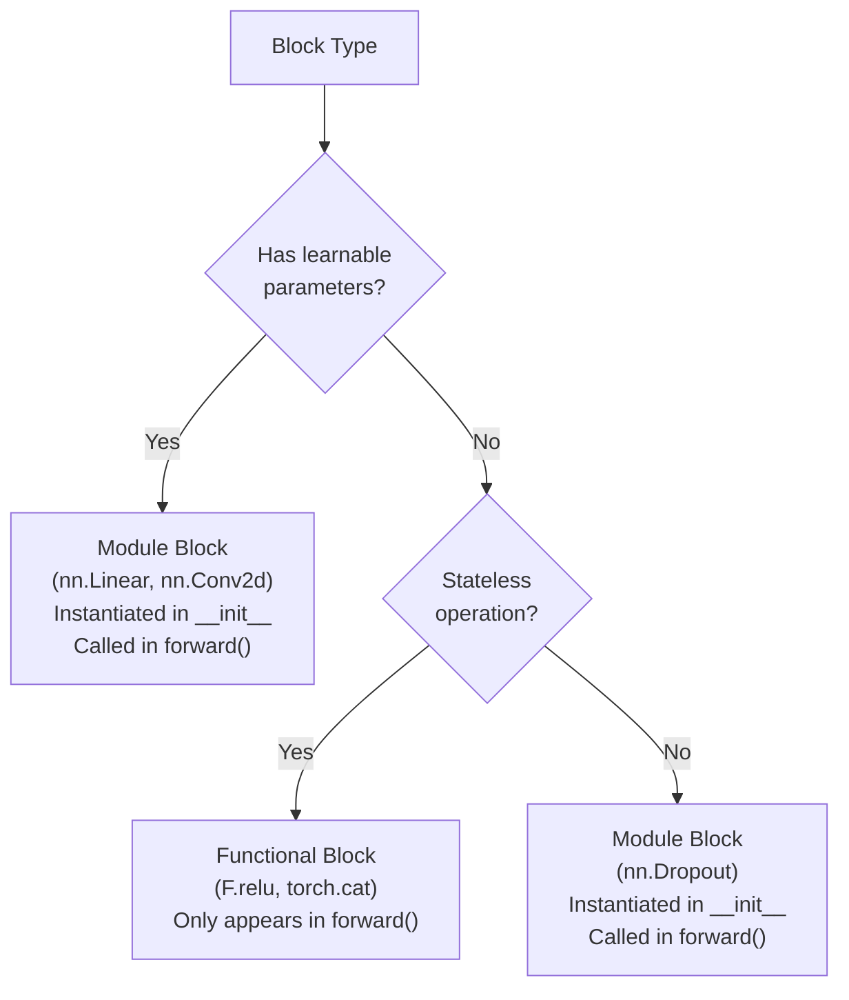
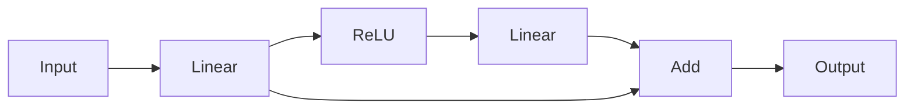
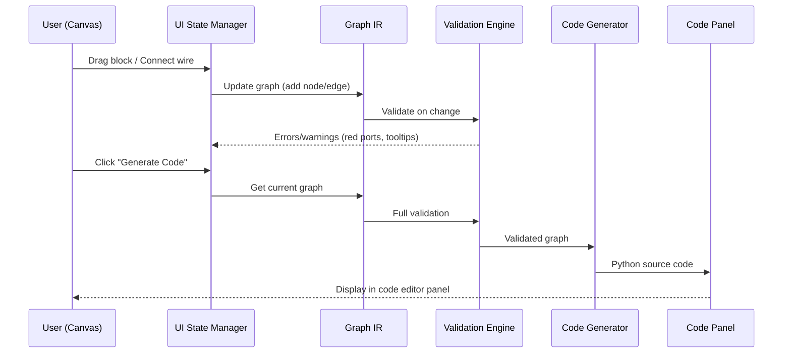

# ArchiDE — Backend Architecture Plan

A visual block-based ML model builder that converts drag-and-drop UI into executable PyTorch code.

## Background & Problem

The user wants to build a "SimulIDE for ML models" — a visual editor where blocks representing ML operations (activation functions, dropout, attention, transformer blocks, etc.) can be dragged, dropped, and connected. The visual graph must be **correctly and efficiently** converted to PyTorch code.

The core challenge is: **how do you faithfully translate an arbitrary visual DAG of heterogeneous ML operations into idiomatic, correct PyTorch `nn.Module` code?**

---

## High-Level Architecture



The system has **four core subsystems** that work in a pipeline:

| Subsystem | Responsibility |
|---|---|
| **Block Registry** | Defines every block type: its ports, parameters, constraints, and PyTorch mapping |
| **Graph IR** | The canonical intermediate representation of the user's visual graph |
| **Validation Engine** | Checks the graph for correctness before code generation |
| **Code Generator** | Emits clean, idiomatic PyTorch `nn.Module` Python code |

---

## 1. Block Registry — The Type System

Every draggable block in the UI is backed by a **Block Definition** in the registry. This is the single source of truth for what blocks exist and how they behave.

### Block Definition Schema

```json
{
  "id": "linear",
  "name": "Linear",
  "category": "layers",
  "description": "Fully connected linear transformation",
  
  "ports": {
    "inputs": [
      { "name": "input", "dtype": "tensor", "shape_ref": "[-1, in_features]" }
    ],
    "outputs": [
      { "name": "output", "dtype": "tensor", "shape_ref": "[-1, out_features]" }
    ]
  },
  
  "params": [
    { "name": "in_features",  "type": "int",  "required": true,  "default": null },
    { "name": "out_features", "type": "int",  "required": true,  "default": null },
    { "name": "bias",         "type": "bool", "required": false, "default": true }
  ],
  
  "pytorch": {
    "type": "module",
    "class": "nn.Linear",
    "constructor_args": ["in_features", "out_features", "bias"],
    "forward_call": "{output} = self.{name}({input})"
  }
}
```

### Block Categories

| Category | Examples | PyTorch Mapping |
|---|---|---|
| **Layers** | Linear, Conv1d/2d/3d, Embedding, LSTM, GRU | `nn.Module` subclasses |
| **Activations** | ReLU, GELU, Sigmoid, Tanh, Softmax | `nn.Module` or `F.functional` calls |
| **Normalization** | BatchNorm, LayerNorm, GroupNorm | `nn.Module` subclasses |
| **Regularization** | Dropout, AlphaDropout | `nn.Module` subclasses |
| **Pooling** | MaxPool, AvgPool, AdaptiveAvgPool | `nn.Module` subclasses |
| **Tensor Ops** | Reshape, Flatten, Concat, Split, Add, Multiply | `torch` functions or `nn.Module` wrappers |
| **Composite** | TransformerBlock, MultiHeadAttention, ResidualBlock | Nested `nn.Module` (sub-graphs) |
| **I/O** | Input, Output | Graph entry/exit points |

### Two Types of PyTorch Mappings



This distinction is critical because:
- **Module blocks** → need a line in `__init__` AND `forward`
- **Functional blocks** → only need a line in `forward`

---

## 2. Graph IR — The Intermediate Representation

The Graph IR is the **canonical data structure** that the UI serializes to and the backend operates on. It's a JSON-serializable directed graph.

### IR Schema

```json
{
  "version": "1.0",
  "name": "MyTransformer",
  "metadata": {
    "created_at": "2026-07-22T10:00:00Z",
    "description": "A simple transformer classifier"
  },
  
  "nodes": {
    "node_1": {
      "block_type": "input",
      "params": { "shape": [null, 128] },
      "position": { "x": 100, "y": 200 }
    },
    "node_2": {
      "block_type": "linear",
      "params": { "in_features": 128, "out_features": 64, "bias": true },
      "position": { "x": 300, "y": 200 }
    },
    "node_3": {
      "block_type": "relu",
      "params": {},
      "position": { "x": 500, "y": 200 }
    },
    "node_4": {
      "block_type": "output",
      "params": {},
      "position": { "x": 700, "y": 200 }
    }
  },
  
  "edges": [
    { "id": "e1", "source": "node_1", "source_port": "output", "target": "node_2", "target_port": "input" },
    { "id": "e2", "source": "node_2", "source_port": "output", "target": "node_3", "target_port": "input" },
    { "id": "e3", "source": "node_3", "source_port": "output", "target": "node_4", "target_port": "input" }
  ]
}
```

### Key Design Decisions

> [!IMPORTANT]
> **Ports, not just edges.** Each block has named input/output ports. This is essential for multi-input blocks (e.g., `Add` takes two tensors, `Concat` takes N tensors, `Attention` takes Q/K/V). Without ports, you can't distinguish which input is which.

> [!IMPORTANT]
> **Node IDs are stable strings**, not array indices. This makes the graph robust to insertions/deletions and allows the UI to reference nodes by ID.

### Handling Complex Topologies

The IR must handle more than simple sequential chains:

| Topology | Example | How It's Represented |
|---|---|---|
| **Sequential** | Linear → ReLU → Linear | Simple chain of edges |
| **Skip Connection** | ResNet residual | One node's output connects to two downstream nodes; an `Add` node merges them |
| **Multi-Input** | Concatenation | Multiple edges into the same node, on different named ports |
| **Multi-Output** | Split operation | One node with multiple output ports |
| **Fan-out** | Shared features | One output port connects to multiple downstream nodes |
| **Composite / Sub-graph** | Transformer Block | A node whose `block_type` references a sub-graph (see Composite Blocks below) |

### Example: Skip Connection (ResNet-style)



The IR for this has a fan-out from L1 (one edge to R1, one edge to ADD) and a multi-input at ADD:

```json
{
  "edges": [
    { "source": "in",  "source_port": "output", "target": "l1",  "target_port": "input" },
    { "source": "l1",  "source_port": "output", "target": "r1",  "target_port": "input" },
    { "source": "r1",  "source_port": "output", "target": "l2",  "target_port": "input" },
    { "source": "l2",  "source_port": "output", "target": "add", "target_port": "a" },
    { "source": "l1",  "source_port": "output", "target": "add", "target_port": "b" },
    { "source": "add", "source_port": "output", "target": "out", "target_port": "input" }
  ]
}
```

---

## 3. Composite Blocks — Hierarchical Sub-graphs

A critical feature is the ability to have **composite blocks** — blocks that are themselves sub-graphs. This is how you implement Transformer Blocks, Encoder/Decoder stacks, etc.

### Design: Nested Graph References

```json
{
  "id": "transformer_block",
  "name": "Transformer Block",
  "category": "composite",
  
  "ports": {
    "inputs":  [{ "name": "input", "dtype": "tensor" }],
    "outputs": [{ "name": "output", "dtype": "tensor" }]
  },
  
  "params": [
    { "name": "d_model",   "type": "int", "default": 512 },
    { "name": "num_heads", "type": "int", "default": 8 },
    { "name": "d_ff",      "type": "int", "default": 2048 },
    { "name": "dropout",   "type": "float", "default": 0.1 }
  ],
  
  "sub_graph": {
    "nodes": { "...sub-graph nodes..." },
    "edges": [ "...sub-graph edges..." ],
    "port_mapping": {
      "input":  "sub_input_node.input",
      "output": "sub_output_node.output"
    }
  }
}
```

### Two Code Generation Strategies for Composite Blocks

| Strategy | Behavior | When to Use |
|---|---|---|
| **Inline** | Flatten the sub-graph into the parent graph during code gen | Simple composites, avoids nested classes |
| **Nested Module** | Generate a separate `nn.Module` class for the composite | Complex composites, reusable across the graph |

> [!IMPORTANT]
> **Decision needed:** Should the user be able to "look inside" composite blocks and edit their sub-graphs? This affects the UI significantly. For the initial version, I'd recommend **pre-built composite blocks** with configurable parameters (like PyTorch's `nn.TransformerEncoderLayer`), and add editable sub-graphs later.

---

## 4. Validation Engine

Before code generation, the graph must be validated. Validation runs in stages:

### Stage 1: Structural Validation
- ✅ Graph is a DAG (no cycles in the data flow)
- ✅ Exactly one input node and at least one output node
- ✅ All edges connect to valid ports
- ✅ No dangling/disconnected nodes
- ✅ All required parameters are filled in
- ✅ No port has multiple incoming edges (unless explicitly a multi-input port)

### Stage 2: Type Checking
- ✅ Connected ports have compatible dtypes
- ✅ Parameter values are within valid ranges

### Stage 3: Shape Inference & Validation

This is the most complex and most valuable validation. The system propagates tensor shapes through the graph to catch dimension mismatches **before** code generation.

**Approach: Rule-based shape propagation**

Each block definition includes shape inference rules:

```javascript
// Shape rule for nn.Linear
shape_rules: {
  "output": (inputs, params) => {
    const input_shape = inputs["input"];  // e.g., [-1, 128]
    return [...input_shape.slice(0, -1), params.out_features];  // [-1, 64]
  }
}

// Shape rule for nn.Conv2d  
shape_rules: {
  "output": (inputs, params) => {
    const [N, C, H, W] = inputs["input"];
    const H_out = Math.floor((H + 2*params.padding - params.kernel_size) / params.stride + 1);
    const W_out = Math.floor((W + 2*params.padding - params.kernel_size) / params.stride + 1);
    return [N, params.out_channels, H_out, W_out];
  }
}
```

The engine does a **topological-order traversal**, computing the output shape of each node from its input shapes, and checking compatibility at each connection.

> [!TIP]
> For the initial version, shape inference can be **optional but recommended**. Users can leave shapes as `"auto"` and the system will try to infer, but won't block code generation if inference fails (since PyTorch will catch shape errors at runtime anyway).

---

## 5. Code Generator — The Core Engine

The code generator takes a validated Graph IR and emits a complete Python file containing an `nn.Module` class.

### Generation Pipeline

```mermaid
flowchart TD
    A["Validated Graph IR"] --|"Topological Sort"| B["Topological Sort"]
    B --|"Variable Name Assignment"| C["Variable Name Assignment"]
    C --|"__init__ Generation"| D["__init__ Generation"]
    D --|"forward() Generation"| E["forward() Generation"]
    E --|"Import Collection"| F["Import Collection"]
    F --|"Python Source Assembly"| G["Python Source Assembly"]
    G --|"Code Formatting (black)"| H["Code Formatting"]
```

### Step-by-Step

#### Step 1: Topological Sort
Sort the nodes so that every node is processed after all its inputs. This determines the execution order in `forward()`.

#### Step 2: Variable Name Assignment
Assign clean Python variable names to each node's output tensor:

| Node ID | Block Type | Variable Name | Module Name |
|---|---|---|---|
| `node_1` | Input | `x` | — |
| `node_2` | Linear | `linear_out` | `self.linear_1` |
| `node_3` | ReLU | `relu_out` | — (functional) |
| `node_4` | Output | `return` | — |

**Naming strategy:**
- Input nodes → `x` (or `x_1`, `x_2` for multiple inputs)
- Module outputs → `{block_type}_{n}_out` (e.g., `linear_1_out`, `conv2d_2_out`)
- When a variable is only used once and immediately, it can be inlined

#### Step 3: Generate `__init__`
For each **module block** in topological order:

```python
def __init__(self):
    super().__init__()
    self.linear_1 = nn.Linear(128, 64, bias=True)
    self.relu = nn.ReLU()
    self.linear_2 = nn.Linear(64, 10)
```

#### Step 4: Generate `forward()`
For each node in topological order, emit the corresponding line:

```python
def forward(self, x):
    linear_1_out = self.linear_1(x)
    relu_out = self.relu(linear_1_out)
    linear_2_out = self.linear_2(relu_out)
    return linear_2_out
```

#### Step 5: Handle Complex Topologies

**Skip connections / fan-out:**
When a node's output feeds multiple downstream nodes, the variable is simply referenced multiple times:

```python
def forward(self, x):
    linear_1_out = self.linear_1(x)      # fan-out: used by relu AND add
    relu_out = self.relu(linear_1_out)
    linear_2_out = self.linear_2(relu_out)
    add_out = linear_1_out + linear_2_out  # skip connection merge
    return add_out
```

**Multi-input nodes:**
Nodes like `Concat` or `Add` that take multiple inputs reference multiple variables:

```python
concat_out = torch.cat([branch_a_out, branch_b_out], dim=1)
```

**Tensor operations:**
Non-module operations map to functional calls:

```python
reshape_out = x.view(batch_size, -1)
flatten_out = torch.flatten(x, start_dim=1)
```

### Full Generated Output Example

For a simple classifier with a skip connection:

```python
import torch
import torch.nn as nn
import torch.nn.functional as F


class MyModel(nn.Module):
    """Generated by ArchiDE"""
    
    def __init__(self):
        super().__init__()
        self.linear_1 = nn.Linear(128, 64)
        self.batch_norm = nn.BatchNorm1d(64)
        self.relu = nn.ReLU()
        self.dropout = nn.Dropout(p=0.2)
        self.linear_2 = nn.Linear(64, 64)
        self.linear_3 = nn.Linear(64, 10)
    
    def forward(self, x):
        # First block
        linear_1_out = self.linear_1(x)
        bn_out = self.batch_norm(linear_1_out)
        relu_out = self.relu(bn_out)
        drop_out = self.dropout(relu_out)
        
        # Second block with skip connection
        linear_2_out = self.linear_2(drop_out)
        residual = linear_2_out + relu_out  # skip connection
        
        # Output head
        output = self.linear_3(residual)
        return output
```

---

## 6. Optimizations for Efficient Code Generation

### Sequential Detection
When a chain of nodes forms a pure sequential pipeline (each node has exactly one input and one output, connected linearly), collapse them into `nn.Sequential`:

```python
# Instead of:
self.linear_1 = nn.Linear(128, 64)
self.relu_1 = nn.ReLU()
self.linear_2 = nn.Linear(64, 32)
self.relu_2 = nn.ReLU()

# Generate:
self.block = nn.Sequential(
    nn.Linear(128, 64),
    nn.ReLU(),
    nn.Linear(64, 32),
    nn.ReLU(),
)
```

> [!NOTE]
> Sequential detection should be **optional** — the user should be able to toggle between "explicit" mode (every layer named) and "compact" mode (sequential chains collapsed). Explicit mode is better for debugging; compact mode produces cleaner code.

### ModuleList for Repeated Blocks
When the same block pattern is repeated N times (e.g., stacked transformer layers), generate `nn.ModuleList`:

```python
self.transformer_layers = nn.ModuleList([
    TransformerBlock(d_model=512, num_heads=8) for _ in range(6)
])

def forward(self, x):
    for layer in self.transformer_layers:
        x = layer(x)
    return x
```

---

## 7. Technology Stack

| Component | Technology | Rationale |
|---|---|---|
| **Frontend (UI)** | HTML/CSS/JS + Canvas or SVG (later: React Flow / Rete.js) | Block-based visual editor with drag-and-drop |
| **Graph IR** | JSON | Serializable, portable, easy to debug |
| **Backend Logic** | JavaScript (browser-side) initially; Python backend later | Keep it simple — codegen can run entirely client-side for v1 |
| **Code Generation** | Template-based string generation | Simple, predictable, debuggable |
| **Shape Inference** | JavaScript rule engine | Runs in browser for instant feedback |
| **Code Output** | Python (PyTorch) | Primary target framework |

> [!IMPORTANT]
> **Key architectural decision:** For v1, the entire pipeline (Graph IR → Validation → Code Generation) can run **entirely in the browser** in JavaScript. No server needed. This makes the tool instantly usable with zero setup. A Python backend can be added later for features like training visualization.

---

## 8. Data Flow Summary



---

## Open Questions

> [!IMPORTANT]
> **Q1: Should code generation be real-time or on-demand?**
> Real-time (re-generate on every change) gives instant feedback but may be distracting. On-demand (click a button) is simpler. A middle ground: show a live preview with a short debounce delay.

> [!IMPORTANT]  
> **Q2: Should composite blocks use PyTorch's built-in implementations or generate from sub-graphs?**
> For example, should a "Transformer Block" map to `nn.TransformerEncoderLayer` directly, or should the user build it from `MultiHeadAttention` + `LayerNorm` + `Linear` blocks? Using built-in is simpler and more efficient; sub-graphs are more flexible.

> [!IMPORTANT]
> **Q3: What's the initial block library scope?**
> Starting with ~20-30 core blocks covering basic layers, activations, normalizations, and a few composites would provide good coverage without overwhelming complexity. Want me to draft the initial block list?

> [!IMPORTANT]
> **Q4: Should the generated code include training boilerplate?**
> The generated code could optionally include a training loop (optimizer, loss function, data loading), or it could be purely the model definition. Model-only is cleaner and more focused for v1.

---

## Proposed Implementation Order

| Phase | What | Deliverable |
|---|---|---|
| **Phase 1** | Block Registry + Graph IR + Basic Code Generator | JSON → PyTorch code for sequential models |
| **Phase 2** | Drag-and-drop UI with canvas | Visual block editor |
| **Phase 3** | Validation Engine + Shape Inference | Real-time error feedback |
| **Phase 4** | Complex topologies (skip connections, multi-input) | Full DAG support |
| **Phase 5** | Composite blocks | Transformer, ResNet blocks |
| **Phase 6** | Code optimizations (Sequential detection, ModuleList) | Cleaner output |
| **Phase 7** | Training visualization + Custom blocks | Advanced features |

---

## Verification Plan

### Automated Tests
- Unit tests for each block's code generation (block def → correct PyTorch snippet)
- Integration tests: sample Graph IRs → generated code → actually instantiate and run a forward pass with dummy data
- Shape inference tests: verify propagated shapes match PyTorch's actual output shapes

### Manual Verification
- Build sample models (MLP, CNN, ResNet skip-connection, Transformer) through the UI
- Compare generated code with hand-written PyTorch equivalents
- Run generated models with dummy data to verify they execute without errors

---

**End of Plan**
