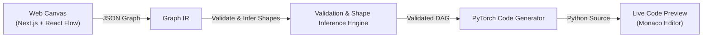

# ArchiDE — Comprehensive Implementation Plan

A modern, web-native visual IDE for building machine learning model architectures by dragging, dropping, and connecting blocks, automatically generating clean PyTorch (`nn.Module`) code.

---

## 1. Vision & Architecture Overview

ArchiDE provides a visual canvas where ML blocks (Layers, Activations, Normalization, Pooling, Multi-Port Tensor Operations) can be connected into arbitrary Directed Acyclic Graphs (DAGs). The system validates graph topology and tensor shapes in real-time and compiles the graph into clean, idiomatic PyTorch code.

---

## 2. Technology Stack & Framework Decision

### Decision: Next.js (App Router) + React Flow (`@xyflow/react`) + Zustand

After evaluating web node editor options (Vanilla JS vs Vite SPA vs Next.js), **Next.js with React Flow and Zustand** is selected:

| Technology | Role | Rationale |
|---|---|---|
| **Next.js (App Router)** | Web Framework | Production-ready React 19/18 support, clean folder structure, fast client-side rendering with SSR capabilities, easy Vercel/Node deployment. |
| **React Flow (`@xyflow/react`)** | DAG Canvas | Industry-standard node-based visual editor library. Handles node dragging, custom handles/ports, bezier connection rendering, zoom/pan, minimap, selection, edge deletion. |
| **Zustand** | State Management | Lightweight, high-performance atomic state management for node position, graph state, parameter edits, and shape propagation without unnecessary re-renders. |
| **Lucide React** | Icons | Clean icon set for layers, ports, and action controls. |
| **Monaco Editor / Prism** | Code View | Syntax highlighting and copy/export capabilities for generated PyTorch code. |

---

## 3. Core Subsystems

### Subsystem 1: Block Registry (`src/lib/blocks.ts`)
- Defines every available block (Linear, Conv2D, ConvTranspose2D, Flatten, ReLU, Sigmoid, Tanh, GELU, Softmax, BatchNorm2D, LayerNorm, Dropout, MaxPool2D, AvgPool2D, Add, Concat, MultiHeadAttention, Input, Output).
- Each block contains metadata, parameter types & default values, input/output port definitions, and PyTorch template definitions.
- Detailed spec: [`docs/block_registry_spec.md`](docs/block_registry_spec.md).

### Subsystem 2: Graph Intermediate Representation (`src/types/graph.ts`)
- JSON schema for nodes, edges, ports, parameter states, and inferred shapes.
- Detailed spec: [`docs/graph_ir_spec.md`](docs/graph_ir_spec.md).

### Subsystem 3: Validation & Shape Propagation Engine (`src/lib/engine/shapeInference.ts`)
- **Topological Sorting**: Kahn's algorithm for ordering nodes and detecting cycles.
- **Shape Propagation**: Calculates output shape tensors across the graph (e.g., propagating `[B, C, H, W]` through Conv2D, MaxPool2D, and Flatten to populate downstream `Linear(in_features)` automatically).

### Subsystem 4: PyTorch Code Generator (`src/lib/engine/codegen.ts`)
- Translates validated Graph IR into clean Python code:
  - Generates `__init__()` instantiations for module blocks.
  - Generates `forward()` execution statements matching topological order and edge connections.
  - Handles skip connections (`x + residual`) and multi-port operations (`torch.cat([a, b], dim=1)`).

---

## 4. Comparison with MLForge (`zaina-ml/ml_forge`)

ArchiDE adapts key architectural patterns from the open-source MLForge desktop app while optimizing specifically for web UI and model architecture generation:

- **Adapted from MLForge**: Declarative block definitions, parameter auto-fill, topological sorting, string template code generation.
- **Stripped out for PoC**: Dataset loaders, image augmentation nodes, PyTorch CUDA training execution, live loss charts, and local inference GUI.
- **Web Enhancements**: Full DAG support (skip connections, multi-input nodes like Attention and Concat), web-native React Flow canvas, live side-by-side PyTorch code editor.
- Detailed comparison: [`docs/ml_forge_comparison.md`](docs/ml_forge_comparison.md).

---

## 5. Step-by-Step Implementation Roadmap

### Phase 1: Documentation & Specification (Completed)
- [x] Create implementation plan (`docs/implementation_plan.md`)
- [x] Create MLForge comparison analysis (`docs/ml_forge_comparison.md`)
- [x] Create block registry specification (`docs/block_registry_spec.md`)
- [x] Create Graph IR and codegen specification (`docs/graph_ir_spec.md`)

### Phase 2: Next.js + React Flow Project Setup
- [ ] Initialize Next.js app with TailwindCSS and React Flow (`@xyflow/react`)
- [ ] Set up layout with Navbar, Left Sidebar (Block Palette), Center Canvas, Right Sidebar (Node Parameter Inspector), and Bottom/Side Live Code Editor

### Phase 3: Visual Canvas & Block Palette
- [ ] Implement Drag-and-Drop from block sidebar onto React Flow canvas
- [ ] Implement custom React Flow nodes with styled input/output handles (ports)
- [ ] Wire connection validation (prevent self-loops, allow multi-input on ports like Add/Concat)

### Phase 4: Shape Propagation & Validation Engine
- [ ] Implement Kahn's topological sort for cycle detection
- [ ] Implement shape inference rules for Conv2D, Linear, MaxPool2D, Flatten, BatchNorm2D
- [ ] Add auto-fill support for downstream `in_channels` and `in_features`

### Phase 5: PyTorch Code Generator & Code Preview Panel
- [ ] Implement template generator for `__init__()` and `forward()`
- [ ] Add support for residual skip connections (`x + res`) and concatenation
- [ ] Integrate syntax-highlighted code panel with "Copy Code" and "Export .py" buttons

---

## 6. Verification & Testing Strategy

1. **Graph IR Unit Tests**:
   - Verify topological sort on linear chains, ResNet skip connections, and transformer multi-head attention graphs.
   - Verify cycle detection throws descriptive errors.
2. **Shape Propagation Verification**:
   - Verify shape calculations match PyTorch's native `nn.Conv2d`, `nn.MaxPool2d`, and `nn.Linear` output shapes.
3. **Generated PyTorch Execution Verification**:
   - Run generated Python code through PyTorch to confirm `model = Model()` instantiates and `model(torch.randn(1, 3, 224, 224))` executes cleanly without shape errors.
