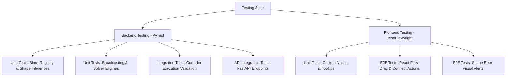

# Rigorous Testing Strategy Plan for ArchiDE

This document details the blueprint for developing a robust, automated, and multi-layered testing framework for the ArchiDE visual ML builder. It covers the Python FastAPI backend, custom PyTorch compilation engine, dynamic shape propagation solver, and the Next.js React Flow frontend.

---

## 1. Architecture Overview of the Testing Suite

We propose a multi-layered testing architecture to isolate, verify, and validate all aspects of ArchiDE:

---

## 2. Backend Testing Modules (Python & PyTest)

The backend testing suite will live in `backend/tests/` and be divided into four distinct test domains.

### Domain A: Block Registry & Shape Inference Unit Tests
Every block in the registry (Convolutional, Pooling, Linear, Activation, Normalization, Recurrent, and Tensor Operations) needs unit testing with:
1. **Nominal Input Validation**: Verify default values and standard tensor shapes.
2. **Boundary Testing**: Strides/paddings set to minimums (e.g. 0 or 1), batch sizes = 1 or very large.
3. **Invalid Configurations**: Ensure validation errors are thrown when invalid bounds are passed (e.g. negative input channels, odd kernels in even paddings).
4. **Parameter Schema Types**: Check that inputs conform to specified float/int/string validations.

### Domain B: Dimension Broadcasting & Propagation Solver
1. **Tensor Broadcasting Rule Check**:
   - Verify right-aligned and left-aligned NumPy/PyTorch-style shape broadcasting rules.
   - Assert correct output shapes for operations like `Add`, `Subtract`, `Multiply`, `Divide` when sizes differ (e.g., shape `(3,)` broadcasting with `(4, 3)`).
2. **Dynamic Dimension Handling**:
   - Ensure dynamic shapes containing `"ANY"` (representing flexible dimension variables) propagate down the graph safely without raising validation errors.
3. **Topological Graph Sorting**:
   - Validate sorting orders on serial, branching, disconnected, and empty graphs.
   - Confirm cycles are detected early with structured exceptions.

### Domain C: PyTorch Compiler Execution Validation (Ast/Runtime Check)
Instead of just checking generated strings, we will run two validation checks on the compiler output:
1. **Python Compilation (Syntax Check)**:
   - Run python's built-in `compile(generated_code, "<string>", "exec")` to assert the syntax is 100% valid Python.
2. **PyTorch Execution (Runtime Validation)**:
   - Dynamically load the generated `Model` class into local memory using `exec()`.
   - Instantiate the model: `model = Model()`.
   - Create mock PyTorch inputs (e.g. `x = torch.randn(input_shape)`).
   - Feed inputs through forward: `output = model(x)`.
   - Verify the shape of `output` matches the shape predicted by our solver.

### Domain D: API Route Integration Tests
Verify endpoints using `fastapi.testclient.TestClient`:
1. `/api/blocks`: Assert all required core blocks are returned with their complete definitions.
2. `/api/check`: Assert successful checking returns `ok: true` and the dictionary of all node shapes, and incompatible connections return a structured `ShapeMismatch` JSON payload with HTTP Status 422.
3. `/api/compile`: Assert cycle errors return HTTP Status 400.

---

## 3. Frontend Testing Suite (Next.js & Jest/Playwright)

### Domain E: Component Unit Testing (Jest & React Testing Library)
1. **Properties Panel Section Rendering**:
   - Verify that when a node is selected, its hyperparameters, variable name overrides, and inferred shape states display in the proper segmented categories.
2. **Tooltip Hover Triggering**:
   - Mock node hover state to verify input/output shape indicators appear accurately.
   - Mock custom edge hover state to assert the tooltip overlays on the edge midpoint.

### Domain F: End-to-End Interactive Flow Tests (Playwright)
1. **Drag-and-Drop Operations**:
   - Simulate dragging block cards from the left panel onto the canvas, validating that React Flow instantiates the node correctly.
2. **Handle-to-Handle Connections**:
   - Connect target and source ports together and confirm active edge establishment.
3. **Visual Shape Checking Interactions**:
   - Connect two blocks of mismatched shapes, click the "Run Static Tensor Check" button in the header, and assert that the mismatching node is bordered in red and displays a warning badge.
   - Adjust the mismatched configuration, re-run, and assert the warning border is removed.

---

## 4. Automation & CI/CD Pipeline

To ensure tests are run continuously, we propose:
1. **Pre-commit Hooks**: Set up `pre-commit` to format backend files with `black` and run basic syntax tests.
2. **GitHub Actions Workflow**:
   - Set up standard CI matrix running Python 3.10/3.11 and Node.js 18/20.
   - Install dependencies, build the frontend (`npm run build`), spin up the backend, run the full backend PyTest suite, and run Playwright tests headlessly.
   - Run coverage check.
3. **Code Coverage Integration**: Run `pytest --cov=backend/` with a minimum threshold target of 90% test coverage.
